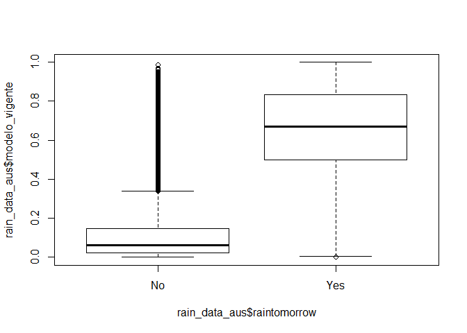

Processo Cientista: Análise Exploratória
================

## Introdução

Para conhecer melhor os dados com que vamos trabalhar, vamos conduzir
uma análise exploratória das bases disponibilizadas, mantendo em mente o
nosso objetivo: construir um modelo preditivo para determinar se vai ou
não chover amanhã. Vamos carregar os pacotes que serão utilizados:

``` r
library(tidyverse)
```

## Importação dos dados

``` r
rain_data_aus <- read_csv('data/rain_data_aus.csv')
wind_table_01 <- read_csv('data/wind_table_01.csv')
wind_table_02 <- read_csv('data/wind_table_02.csv')
wind_table_03 <- read_csv('data/wind_table_03.csv')
wind_table_04 <- read_csv('data/wind_table_04.csv')
wind_table_05 <- read_csv('data/wind_table_05.csv')
wind_table_06 <- read_csv('data/wind_table_06.csv')
wind_table_07 <- read_csv('data/wind_table_07.csv')
wind_table_08 <- read_csv('data/wind_table_08.csv')
```

## Análises preliminares

Vamos dar uma primeira olhada em cada uma das bases carregadas:

``` r
glimpse(rain_data_aus)
```

    ## Observations: 142,193
    ## Variables: 23
    ## $ date             <date> 2008-12-01, 2008-12-02, 2008-12-03, 2008-12-04, 200…
    ## $ location         <chr> "Albury", "Albury", "Albury", "Albury", "Albury", "A…
    ## $ mintemp          <dbl> 13.4, 7.4, 12.9, 9.2, 17.5, 14.6, 14.3, 7.7, 9.7, 13…
    ## $ maxtemp          <dbl> 22.9, 25.1, 25.7, 28.0, 32.3, 29.7, 25.0, 26.7, 31.9…
    ## $ rainfall         <dbl> 0.6, 0.0, 0.0, 0.0, 1.0, 0.2, 0.0, 0.0, 0.0, 1.4, 0.…
    ## $ evaporation      <lgl> NA, NA, NA, NA, NA, NA, NA, NA, NA, NA, NA, NA, NA, …
    ## $ sunshine         <lgl> NA, NA, NA, NA, NA, NA, NA, NA, NA, NA, NA, NA, NA, …
    ## $ humidity9am      <dbl> 71, 44, 38, 45, 82, 55, 49, 48, 42, 58, 48, 89, 76, …
    ## $ humidity3pm      <dbl> 22, 25, 30, 16, 33, 23, 19, 19, 9, 27, 22, 91, 93, 4…
    ## $ pressure9am      <dbl> 1007.7, 1010.6, 1007.6, 1017.6, 1010.8, 1009.2, 1009…
    ## $ pressure3pm      <dbl> 1007.1, 1007.8, 1008.7, 1012.8, 1006.0, 1005.4, 1008…
    ## $ cloud9am         <dbl> 8, NA, NA, NA, 7, NA, 1, NA, NA, NA, NA, 8, 8, NA, 0…
    ## $ cloud3pm         <dbl> NA, NA, 2, NA, 8, NA, NA, NA, NA, NA, NA, 8, 8, 7, N…
    ## $ temp9am          <dbl> 16.9, 17.2, 21.0, 18.1, 17.8, 20.6, 18.1, 16.3, 18.3…
    ## $ temp3pm          <dbl> 21.8, 24.3, 23.2, 26.5, 29.7, 28.9, 24.6, 25.5, 30.2…
    ## $ raintoday        <chr> "No", "No", "No", "No", "No", "No", "No", "No", "No"…
    ## $ amountOfRain     <dbl> 0.0, 0.0, 0.0, 1.0, 0.2, 0.0, 0.0, 0.0, 1.4, 0.0, 2.…
    ## $ raintomorrow     <chr> "No", "No", "No", "No", "No", "No", "No", "No", "Yes…
    ## $ temp             <dbl> 29.480000, 32.120000, 32.840000, 35.600000, 40.76000…
    ## $ humidity         <dbl> 28.400000, 2.208569, 38.000000, 21.200000, 41.600000…
    ## $ precipitation3pm <dbl> 12, 10, 17, 8, 9, 8, 8, 7, 19, 7, 13, 6, 15, 14, 7, …
    ## $ precipitation9am <dbl> 5.115360, 21.497100, 20.782859, 12.028646, 11.883546…
    ## $ modelo_vigente   <dbl> 0.089824603, 0.023477098, 0.027580456, 0.023961612, …

Nos foi fornecido um dicionário dos nomes das
colunas:

| Variable         | Description                                                                                                                                                                                                                                                      |
| ---------------- | ---------------------------------------------------------------------------------------------------------------------------------------------------------------------------------------------------------------------------------------------------------------- |
| Date             | The date of observation                                                                                                                                                                                                                                          |
| Location         | The common name of the location of the weather station                                                                                                                                                                                                           |
| MinTemp          | The minimum temperature in degrees celsius                                                                                                                                                                                                                       |
| MaxTemp          | The maximum temperature in degrees celsius                                                                                                                                                                                                                       |
| Rainfall         | The amount of rainfall recorded for the day in mm                                                                                                                                                                                                                |
| Evaporation      | The so-called Class A pan evaporation (mm) in the 24 hours to 9am                                                                                                                                                                                                |
| Sunshine         | The number of hours of bright sunshine in the day.                                                                                                                                                                                                               |
| WindGustDir      | The direction of the strongest wind gust in the 24 hours to midnight                                                                                                                                                                                             |
| WindGustSpeed    | The speed (km/h) of the strongest wind gust in the 24 hours to midnight                                                                                                                                                                                          |
| WindDir9am       | Direction of the wind at 9am                                                                                                                                                                                                                                     |
| WindDir3pm       | Direction of the wind at 3pm                                                                                                                                                                                                                                     |
| WindSpeed9am     | Wind speed (km/hr) averaged over 10 minutes prior to 9am                                                                                                                                                                                                         |
| WindSpeed3pm     | Wind speed (km/hr) averaged over 10 minutes prior to 3pm                                                                                                                                                                                                         |
| Humidity9am      | Humidity (percent) at 9am                                                                                                                                                                                                                                        |
| Humidity3pm      | Humidity (percent) at 3pm                                                                                                                                                                                                                                        |
| Pressure9am      | Atmospheric pressure (hpa) reduced to mean sea level at 9am                                                                                                                                                                                                      |
| Pressure3pm      | Atmospheric pressure (hpa) reduced to mean sea level at 3pm                                                                                                                                                                                                      |
| Cloud9am         | Fraction of sky obscured by cloud at 9am. This is measured in “oktas”, which are a unit of eigths. It records how many eigths of the sky are obscured by cloud. A 0 measure indicates completely clear sky whilst an 8 indicates that it is completely overcast. |
| Cloud3pm         | Fraction of sky obscured by cloud (in “oktas”: eighths) at 3pm. See Cload9am for a description of the values                                                                                                                                                     |
| Temp9am          | Temperature (degrees C) at 9am                                                                                                                                                                                                                                   |
| Temp3pm          | Temperature (degrees C) at 3pm                                                                                                                                                                                                                                   |
| Precipitation9am | The amount of rain in mm prior to 9am                                                                                                                                                                                                                            |
| Precipitation3pm | The amount of rain in mm prior to 3pm                                                                                                                                                                                                                            |
| AmountOfRain     | The amount of rain in mm                                                                                                                                                                                                                                         |
| Temp             | Temperature (degrees C)                                                                                                                                                                                                                                          |
| Humidity         | Humidity (percent)                                                                                                                                                                                                                                               |
| RainToday        | Boolean: 1 if precipitation (mm) in the 24 hours to 9am exceeds 1mm, otherwise 0                                                                                                                                                                                 |
| RainTomorrow     | The target variable. Did it rain tomorrow?                                                                                                                                                                                                                       |

Notamos algumas divergências:

1.  As variáveis `raintoday` e `raintomorrow` estão codificadas de forma
    diferente, isso deve ser tratado na fase de modelagem.
2.  Não há descrição da variável `modelo_vigente`

<!-- end list -->

``` r
summary(rain_data_aus$modelo_vigente)
```

    ##    Min. 1st Qu.  Median    Mean 3rd Qu.    Max. 
    ## 0.00000 0.03005 0.10085 0.22780 0.32951 0.99940

``` r
boxplot(rain_data_aus$modelo_vigente~rain_data_aus$raintomorrow)
```

<!-- -->

Uma breve análise desta variável sugere que se trata das predições dadas
por um modelo adotado atualmente para a mesma tarefa. A fim de evitar
que nosso modelo seja viesado, não vamos usar essa variável

Vamos continuar analisando as bases
    carregadas:

``` r
names(wind_table_01)
```

    ## [1] "date"           "location"       "wind_gustdir"   "wind_gustspeed"
    ## [5] "wind_dir9am"    "wind_dir3pm"    "wind_speed9am"  "wind_speed3pm"

``` r
names(wind_table_02)
```

    ## [1] "date"           "location"       "wind_gustdir"   "wind_gustspeed"
    ## [5] "wind_dir9am"    "wind_dir3pm"    "wind_speed9am"  "wind_speed3pm"

``` r
names(wind_table_03)
```

    ## [1] "date"          "location"      "windgustdir"   "windgustspeed"
    ## [5] "winddir9am"    "winddir3pm"    "windspeed9am"  "windspeed3pm"

``` r
names(wind_table_04)
```

    ## [1] "date"          "location"      "windgustdir"   "windgustspeed"
    ## [5] "winddir9am"    "winddir3pm"    "windspeed9am"  "windspeed3pm"

``` r
names(wind_table_05)
```

    ## [1] "date"          "location"      "windgustdir"   "windgustspeed"
    ## [5] "winddir9am"    "winddir3pm"    "windspeed9am"  "windspeed3pm"

``` r
names(wind_table_06)
```

    ## [1] "date"          "location"      "windgustdir"   "windgustspeed"
    ## [5] "winddir9am"    "winddir3pm"    "windspeed9am"  "windspeed3pm"

``` r
names(wind_table_07)
```

    ## [1] "date"          "location"      "windgustdir"   "windgustspeed"
    ## [5] "winddir9am"    "winddir3pm"    "windspeed9am"  "windspeed3pm"

``` r
names(wind_table_08)
```

    ## [1] "date"          "location"      "windgustdir"   "windgustspeed"
    ## [5] "winddir9am"    "winddir3pm"    "windspeed9am"  "windspeed3pm"

Notamos que as bases `wind_table_01` e `wind_table_01` usam nomes de
colunas diferente das demais. Vamos corrigir isso e consolidar todas as
bases numa única tabela:

``` r
names(wind_table_01) <- names(wind_table_03)
names(wind_table_02) <- names(wind_table_03)

wind_data <- bind_rows(wind_table_01,
                       wind_table_02,
                       wind_table_03,
                       wind_table_04,
                       wind_table_05,
                       wind_table_06,
                       wind_table_07,
                       wind_table_08) %>% 
  distinct()

rain <- rain_data_aus %>% 
  inner_join(wind_data) %>% 
  distinct()
```

    ## Joining, by = c("date", "location")

``` r
saveRDS(rain, 'data/rain.RDS')
```

A partir de agora, vamos utilizar alguns pacotes que facilitam a
automatização da análise exploratória (Staniak and Biecek 2019). Vamos
focar em pacotes que geram relatórios automaticamente. O script que gera
esses relatórios é o `exploratory_analysis/generate_reports.R`.

## Diagnóstico da base

O relatório pode ser visualizado no arquivo
[reports/dlookr\_diagnose.html](http://htmlpreview.github.io/?https://github.com/guilhermejordan/processo_cientista/blob/master/exploratory_analysis/reports/dlookr_diagnose.html).

### Destaques:

1.  As variáveis `evaporation` e `sunshine` têm mais de 98 % de
    observações missing, sendo de pouca utilidade para a modelagem.
2.  As variáveis `cloud9am` e `cloud3pm` também tem muitas observações
    missing (\> 37 %), requerendo atenção na fase de modelagem.
3.  A maioria das variáveis numéricas apresenta potenciais outliers,
    requerendo atenção na fase de modelagem.
4.  Curiosamente, todos os valores da variável `precipitation9am` são
    únicos.

## Análise exploratória

O relatório pode ser visualizado no arquivo
[reports/dlookr\_eda.html](http://htmlpreview.github.io/?https://github.com/guilhermejordan/processo_cientista/blob/master/exploratory_analysis/reports/dlookr_eda.html).
O principal destaque é que a distribuição da maior parte das variáveis
numéricas é razoavelmente próxima da Normal, apesar dos outliers. Isso
pode colaborar na fase de modelagem. Temos também diversas variáveis com
forte correlação, o que pode ajudar reduzir o número de variáveis
utilizadas pelo modelo.

## DataExplorer

O relatório do DataExplorer pode ser visualizado no arquivo
[reports/dataexplorer.html](http://htmlpreview.github.io/?https://github.com/guilhermejordan/processo_cientista/blob/master/exploratory_analysis/reports/dataexplorer.html).
Destaque para a seção boxplots (by raintomorrow) que já sugere que
algumas variáveis são úteis para a classificação.

## Conclusão

A análise exploratória sugere que, apesar das bases serem razoavelmente
limpas, ainda serão necessários alguns preprocessamentos na fase de
modelagem, dentre eles:

  - imputação de valores missing
  - tratmento de outliers
  - mudança de escala de variáveis

<div id="refs" class="references">

<div id="ref-staniak2019landscape">

Staniak, Mateusz, and Przemyslaw Biecek. 2019. “The Landscape of R
Packages for Automated Exploratory Data Analysis.”

</div>

</div>
